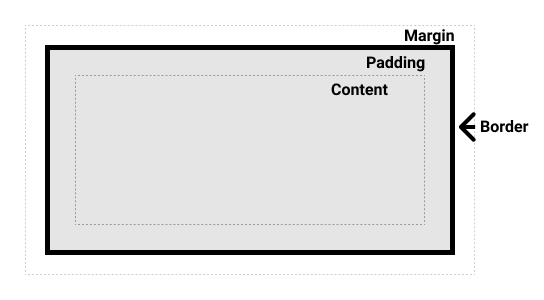
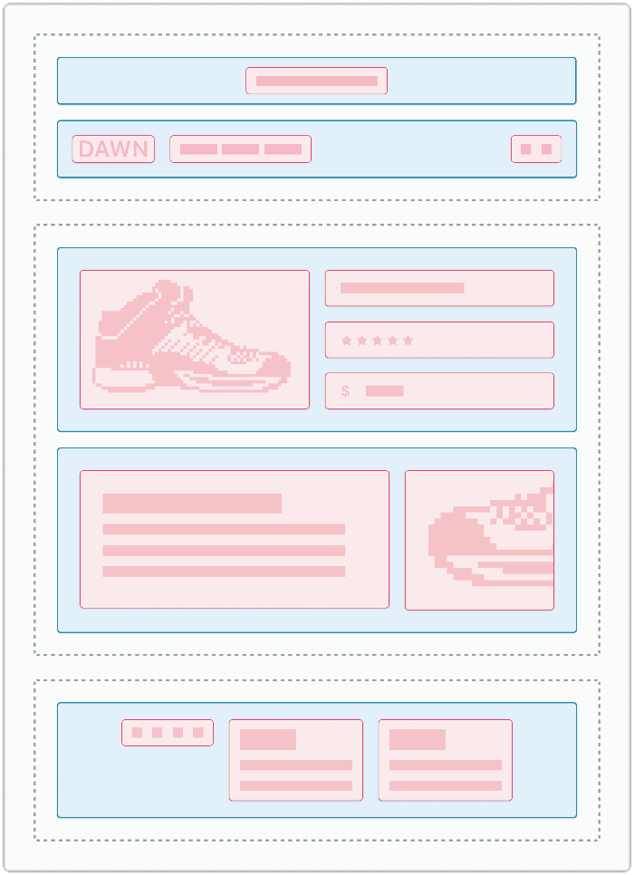
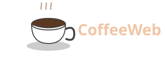

# Как структурировать контент на странице

**Хорошо структурированная статья помогает пользователю быстро ориентироваться в информации.**  
Используйте заголовки, абзацы, списки и визуальные блоки, чтобы сделать контент доступным.

---

**Содержание:**

- [Введение](#введение)
- [Что такое контент-блоки?](#что-такое-контент-блоки)
- [Работа со списками](#работа-со-списками)
- [Пример карточки](#пример-карточки)
- [Заключение](#заключение)

---

## Введение

> Контент можно разбивать на блоки, чтобы упростить восприятие. Особенно важно это в длинных статьях или инструкциях.

Контент-блок — это логически завершённый фрагмент информации. Например, заголовок и параграф, объединённые общей темой.



## Что такое контент-блоки?

> Используйте визуальные разделители и отступы, чтобы отделить один блок от другого.



### Заголовки третьего уровня

Используются для обозначения вложенных смыслов. Например, внутри темы «Контент-блоки» можно выделить подзаголовок «Визуальные подсказки».

## Работа со списками

Списки помогают структурировать однотипную информацию. Например:


- Кратко перечислить шаги
- Разделить сложную тему на пункты
- Сделать текст легче для восприятия

Избегайте длинных пунктов — список должен быть лаконичным.

```css
.list-item {
margin-bottom: 20px;
}

.list-item:last-child {
margin-bottom: 0;
}
```


## Пример карточки

Карточка — это визуальный блок с изображением, заголовком и описанием. Такой подход облегчает восприятие информации.



**Заголовок карточки**  
Описание в две строки  
Цена: **5000 р**

## Заключение

> Продуманный подход к структуре текста облегчает восприятие и делает сайт более профессиональным. Используйте семантическую вёрстку и стилизуйте элементы с помощью классов.
